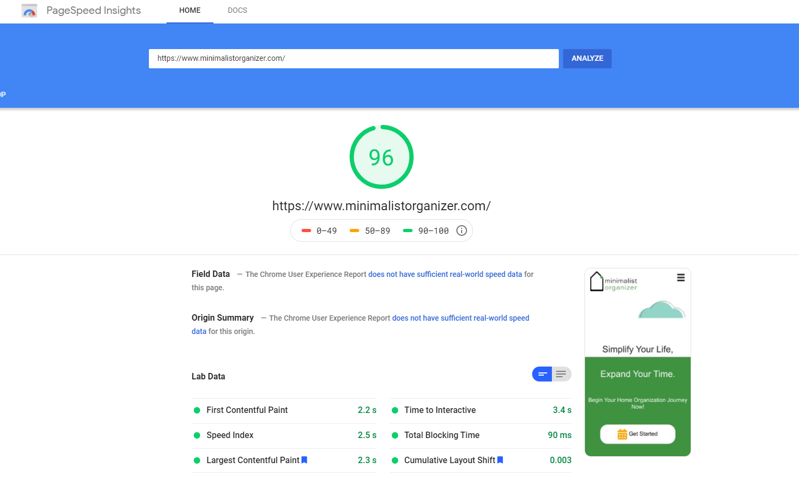
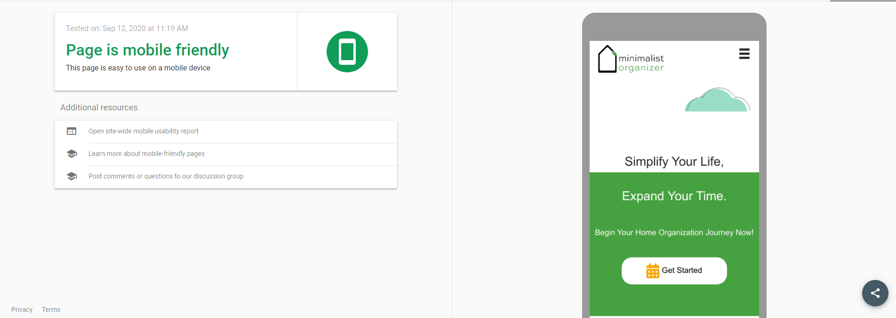
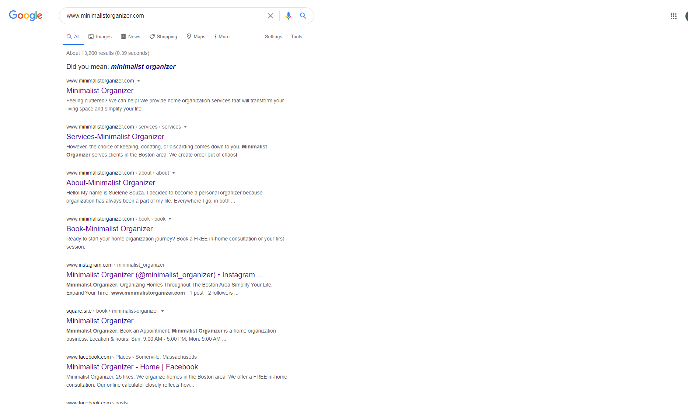
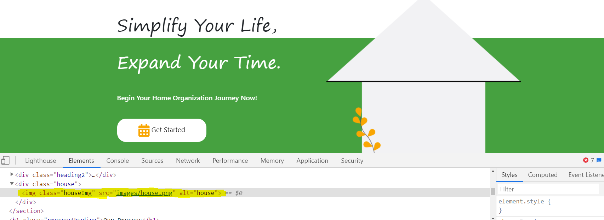
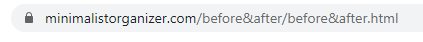

# MinimalistOrganizer
  
 
  

  <h3>Utilizes JAMstack, a modern web development architecture.</h3>
    <h5>This project was built with HTML, CSS, Bootstrap, vanilla Javascript and API's.</h5>
    <h3>Platform:</h3> <a href="https://www.netlify.com/"><h5><b>Netlify</b></h5></a>
    <ul><h3><b>API's</b></h3>
      <a href="https://mailchimp.com/"><li>Mailchimp</li></a>
      <a href="https://www.tawk.to/"><li>Tawk.to</li></a>
      <a href="https://squareup.com/us/en/appointments"><li>Square Appointments</li></a>
      <a href="https://formspree.io/"><li>Formspree</li></a> 
    </ul>
     <ul><h3><b>SEO</b></h3>
      <li>Site is fast, according to googles page speed insights tool 
        </li>
   
      <li>Site is responsive - mobile friendly, according to google 
        </li>
    
      <li>Site is showing up on google. Each page has a unique page title and description meta tags. 
        </li>
    
      <li>Use of alt attribute to specify alternative text for the image if it cannot be displayed. 
        </li>
    
      <li>Use of URLs with words that are relevant to the site's content and structure. HTTPS - SSL to encrypt the website connection. 
        </li>
    
      <a href="https://formspree.io/"><li>Formspree</li></a> 
    </ul>
    
    Built & Designed by: Priscila DaSilva
    
